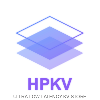

# HPKV REST Client SDKs

This repository contains client SDKs for interacting with the HPKV REST API. HPKV is a high-performance key-value store that combines blazing fast operations with AI-powered search capabilities.

## What is HPKV?

HPKV is a modern key-value store that offers:

- **Blazing Fast Performance**: Sub-microsecond latency on local operations
- **AI-Powered Capabilities**: Semantic search and RAG (Retrieval Augmented Generation)
- **Real-time Features**: WebSocket pub-sub system for real-time monitoring and notifications
- **Low Operational Cost**: 4-5x lower operational costs than leading in-memory KV stores

Learn more at [hpkv.io](https://hpkv.io/).

## Repository Organization

This repository is organized as follows:

```
/sdk
  /node        - Node.js SDK
  /[language]  - SDKs for other languages (coming soon)
```

Currently, the repository includes the following SDKs:

- [Node.js SDK](sdk/node/README.md)

More language SDKs will be added soon.

## Getting a Free HPKV API Key

To use any of the HPKV SDKs, you'll need an API key. You can get a free API key by signing up for the HPKV free tier:

1. Go to [hpkv.io](https://hpkv.io/) and click on "Sign Up"
2. Create an account with your email and password
3. Navigate to the API Keys section in your dashboard
4. Click "Generate API Key"
5. Select your preferred region
6. Add an optional description to identify this key later
7. Save your API key securely - you won't be able to see it again

## Documentation

For more information about the HPKV REST API and SDKs, check out the following resources:

- [HPKV Overview](https://hpkv.io/docs/overview)
- [Getting Started Guide](https://hpkv.io/docs/getting-started)
- [REST API Documentation](https://hpkv.io/docs/rest-api)
- [Nexus Search Documentation](https://hpkv.io/docs/nexus-search)
- [HPKV Blog: Introducing Nexus Search](https://hpkv.io/blog/2025/03/introducing-nexus-search)

## Contributing

Contributions are welcome! If you'd like to add support for additional languages or improve the existing SDKs, please feel free to submit a pull request.

## License

This project is licensed under the terms specified in each SDK's LICENSE file. 